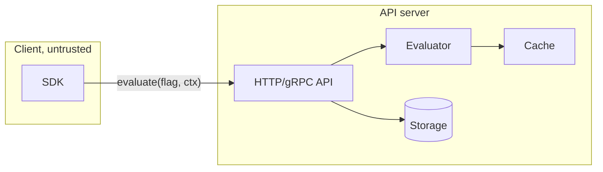
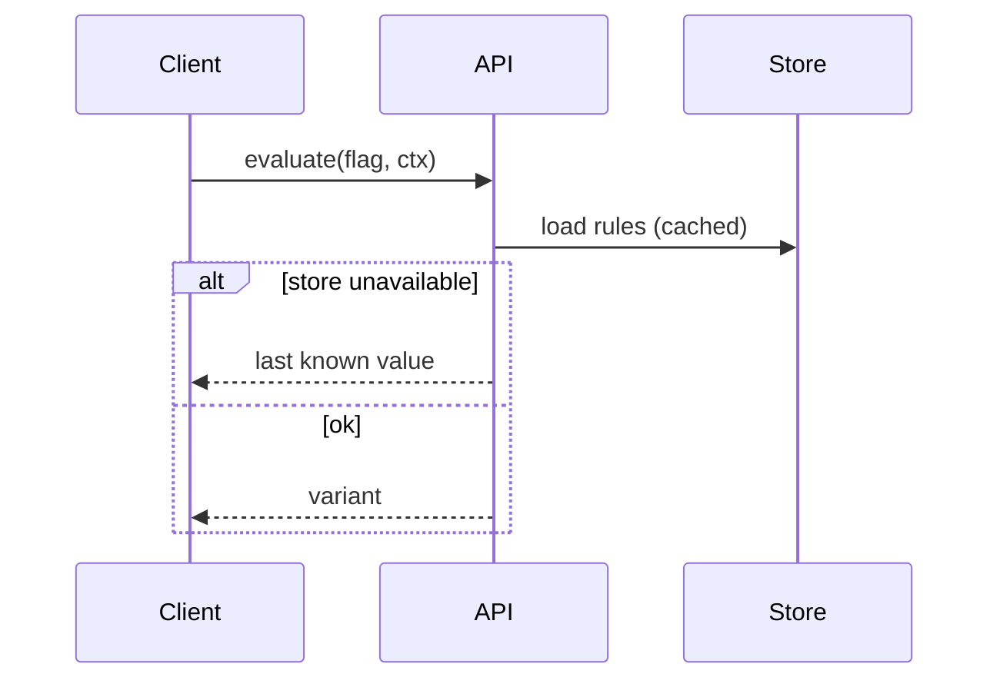
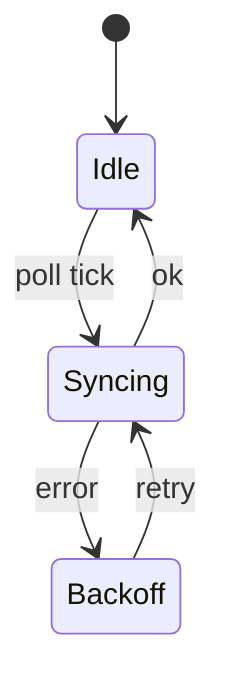

# View catalog

Adapted from HumanLayer's `show-me` skill, extended for architecture maps. The
principle is the same: pick the smallest view that makes the point, keep only
the components, calls, files, and boundaries the reader needs, and put each view
next to the short text it supports. A region file typically uses three to five
of these. None uses all of them.

The examples below use a made-up feature-flag service. In a real map, every
node, file, or call shown must exist in the code. Use real names and add the
path in a comment or label where it helps the reader find it.

## Contents

- Component and boundary diagram
- Sequence diagram
- Call tree
- Shallow file tree
- Data shapes
- State machine
- Pseudocode
- Diff blocks (refresh only)
- HTML (rare)

## Component and boundary diagram

The default view for `index.md`. Show major components and what separates them:
processes, network hops, trust boundaries, package or module lines. Use
subgraphs for boundaries, and label edges with what crosses them.



Keep it to roughly ten nodes. If it needs more, some of them belong in a region.

## Sequence diagram

For the one or two flows that define a region: a request path, a sync cycle,
startup. Show who calls whom and what comes back, including the failure branch
when it matters.



## Call tree

For runtime control flow inside a process. Indentation shows nesting. Name the
path of anything non-obvious.

```text
Server.Start                    (cmd/server/main.go)
  loadConfig
  openStore
    migrate
  startGRPC
  startHTTP
    registerGateway
```

## Shallow file tree

For file and package responsibility. Two levels, one comment per line. Skip
anything that doesn't carry a responsibility the reader needs.

```text
internal/
├── server/        # API handlers, auth middleware
├── storage/       # store interface + sql, fs, git backends
└── cache/         # read-through cache for evaluation
```

## Data shapes

For the structures a region is built around: core types, table schemas, message
formats. Show only the fields that carry design weight, and annotate why a shape
was chosen when you have evidence.

```go
type Rule struct {
    FlagKey     string
    SegmentKeys []string   // was a single key until a later refactor [historical: <sha>]
    Rank        int        // explicit ordering, not insertion order
}
```

Use a Mermaid `erDiagram` when relationships matter more than fields.

## State machine

For anything with a lifecycle: connections, jobs, sync status, documents.



## Pseudocode

For logic or an algorithm whose shape matters more than its syntax.

```text
on(evaluate)
  rules = cache.get(flag) or store.load(flag)
  for rule in rules by rank
    if ctx matches all rule.segments
      return rule.distribution.pick(ctx.entityId)
  return flag.default
```

## Diff blocks (refresh only)

During a refresh, when a region's shape changed, show what changed with a `diff`
block matching the view type, then update the view itself.

```diff
 internal/storage/
 ├── sql/
-└── fs/
+├── fs/
+└── git/          # new: read-only git-backed store
```

## HTML (rare)

Only for one concept too dense for Mermaid (a complex layout, a multi-layer
comparison). Write a single focused file under `docs/map/assets/`, link it from
the region file, and keep the region file's text self-sufficient without it.
