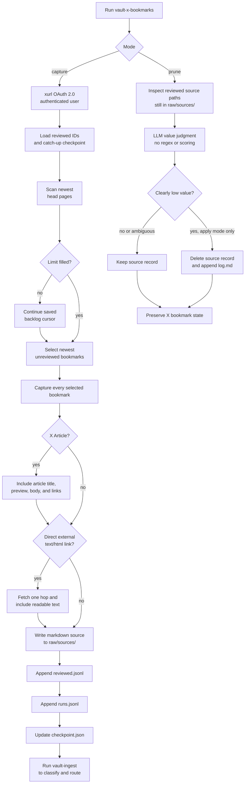

# Vault X Bookmarks

Capture X bookmarks into a raw-first vault workflow, then optionally prune
low-value bookmark source records with LLM judgment.

This skill has two modes:

- **Capture:** Review a bounded slice of the authenticated user's X bookmarks
  and write each selected bookmark as an `external` source record under
  `raw/sources/`.
- **Prune:** Review captured bookmark source records still present in
  `raw/sources/`, using `raw/state/x-bookmarks/reviewed.jsonl` as the source of
  truth, and delete only records that are clearly too thin or irrelevant to
  keep.

Capture mode is apply-only and intentionally conservative about routing. It
captures source records and state, then leaves classification to `vault-ingest`.

## Flow



## Capture Behavior

The bundled TypeScript helper shells out to `xurl --auth oauth2`, resolves the
authenticated user with `xurl whoami`, and fetches bookmark pages from X. It
always scans the newest `--head-pages` first so fresh bookmarks are noticed even
after the older backlog has been processed.

If the head scan does not fill `--limit`, the helper continues from the saved
catch-up cursor until it reaches `--max-pages` or the selected bookmark limit.
The checkpoint advances only after durable state writes, and if a run stops in
the middle of a page, the next run resumes from that page.

Every selected bookmark is captured. The user's bookmark is treated as the
relevance signal, so capture mode does not filter with keyword scoring, regexes,
or model judgment.

Captured source records can include:

- post text, author metadata, URLs, and bookmark metadata
- full `note_tweet` text when X returns a truncated post
- X Article title, preview, body text, and article entity links
- direct external linked-page text when the bookmark payload includes a non-X
  `text/html` URL

External link fetching is one hop only. The helper may fetch URLs surfaced by
the bookmark payload, but it does not crawl links discovered inside fetched
pages.

## State Files

The skill writes vault-local state under `raw/state/x-bookmarks/`:

- `reviewed.jsonl`: bookmark IDs already captured or reviewed
- `runs.jsonl`: append-only run summaries
- `checkpoint.json`: catch-up pagination cursor

These files prevent repeated capture of the same bookmark. They are deliberately
preserved during prune mode, even when a source record is deleted, so discarded
bookmarks are not refetched later.

## Prune Behavior

Prune mode only inspects captured bookmark source records referenced by
`raw/state/x-bookmarks/reviewed.jsonl` whose `source_record_path` still exists
under `raw/sources/`. It does not query X, mutate X bookmarks, or edit the state
files.

Default to report mode unless the user explicitly asks to apply deletion. In
apply mode, delete only records that are clearly low-value, such as bare links,
thin reactions, login-gated captures, boilerplate pages, or topics plainly
unrelated to the vault. Keep ambiguous records and anything with plausible
future value for projects, concepts, research, products, design, engineering,
AI, marketing, or business work.

## Commands

From this skill directory:

```sh
npx tsx scripts/x-bookmarks.ts --limit 15
npx tsx scripts/x-bookmarks.ts --limit 75 --max-pages 25 --head-pages 2
npx tsx scripts/x-bookmarks.ts --path /path/to/vault --limit 20
```

See [scripts/README.md](scripts/README.md) for helper setup, options, output,
and test commands.

## Safety Rules

- Never mutate X bookmarks.
- Never use an app-only bearer token; bookmarks require OAuth 2.0 user context.
- Never route capture output directly into permanent vault folders.
- Run `vault-ingest` after capture to classify and route source records.
- Preserve `raw/state/x-bookmarks/` during pruning.
