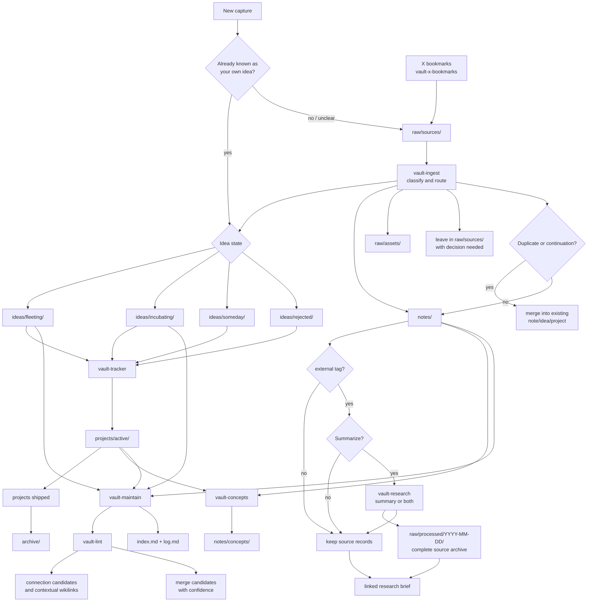

# Vault Plugin

Raw-first vault workflows for Obsidian.

## Current Skill Set

Core skills:

- `vault-ingest`: Categorize `raw/sources/` and move original source files to
  the correct vault locations.
- `vault-lint`: Audit active notes, ideas, and projects for contradictions,
  stale content, weak links, knowledge graph connections, merge candidates, and
  missing concepts.
- `vault-tracker`: Manage project lifecycle state and reconcile tracker entries
  with filesystem reality.
- `vault-maintain`: Run the bounded weekly maintenance loop across ingest,
  hygiene, tracking, and concepts.

Optional skills:

- `vault-concepts`: Promote recurring themes into canonical concept pages.
- `vault-research`: Collect external source records and optionally synthesize
  research summaries when requested.
- `vault-x-bookmarks`: Review a bounded slice of X bookmarks through the X API
  and capture selected items, including X Article text when exposed by the API,
  plus readable one-hop external link content, as `external` source records in
  `raw/sources/`; optionally prune low-value X bookmark source records using LLM
  judgment while preserving bookmark state.

## Flow

## Notes

- Top-level synced copies in `skills/` are regenerated via `npm run sync`.
- See [AGENTS.md](AGENTS.md) for repository-local vault plugin instructions.

## Subagents

- `vault_researcher` in `.codex/agents/vault-researcher.toml` for deep research
  delegation

## Structure

- `.codex-plugin/plugin.json`
- `skills/*/SKILL.md`
- `.codex/agents/*.toml`
- `AGENTS.md`

## Operational Conventions

- Skills are the runtime source of truth.
- Workflows should be non-destructive by default.
- `raw/sources/` is an unprocessed inbox for new captures.
- `vault-x-bookmarks` is an apply-only capture skill. It calls its bundled
  TypeScript helper, writes selected external bookmark records into
  `raw/sources/`, captures X Article title/body/link text when present, fetches
  direct non-X text/html links at most one level deep, and records reviewed IDs
  under `raw/state/x-bookmarks/`; `vault-x-bookmarks` prune should run before
  `vault-ingest` for bookmark batches so low-value pointers are removed before
  later routing.
- `vault-x-bookmarks` prune mode is the only workflow allowed to delete files
  from `raw/sources/`. It may delete only clearly low-value captured bookmark
  source records still present in `raw/sources/`, as identified from
  `raw/state/x-bookmarks/reviewed.jsonl`; it must read the good/low-quality
  examples bundled with the skill, rely on LLM judgment instead of regex or
  scoring, and must not edit `raw/state/x-bookmarks/` so discarded bookmarks are
  not refetched.
- Known owned ideas should go directly to `ideas/fleeting/`,
  `ideas/incubating/`, `ideas/someday/`, or `ideas/rejected/` instead of
  lingering in `raw/sources/`.
- Curated references, research briefs, external-source syntheses, tool lists,
  and topic notes all belong under `notes/`; do not recreate a top-level
  `resources/` directory.
- Notes clipped from external sources should be tagged `external`; that tag
  tells agents they may summarize during processing.
- `raw/processed/` is an immutable source archive organized by processing date.
  It stores complete sources used for synthesis, plus processed sources that did
  not have a better durable home.
- Any source used for synthesis is copied complete into
  `raw/processed/YYYY-MM-DD/`; summaries and briefs link back to those archived
  source records.
- `archive/` is for archived curated material and is excluded from active
  navigation by default.
- Repeated patterns should graduate into canonical concept pages instead of
  remaining only in reports.
- Knowledge graph links should be added when relationships are concrete:
  explicit mentions, shared sources, parent/child relationships, project
  membership, or concept evidence.
- Duplicate or continuation notes should merge into one durable item when
  provenance and links can be preserved.
- Keep user note content intact unless explicit deletion is requested.
