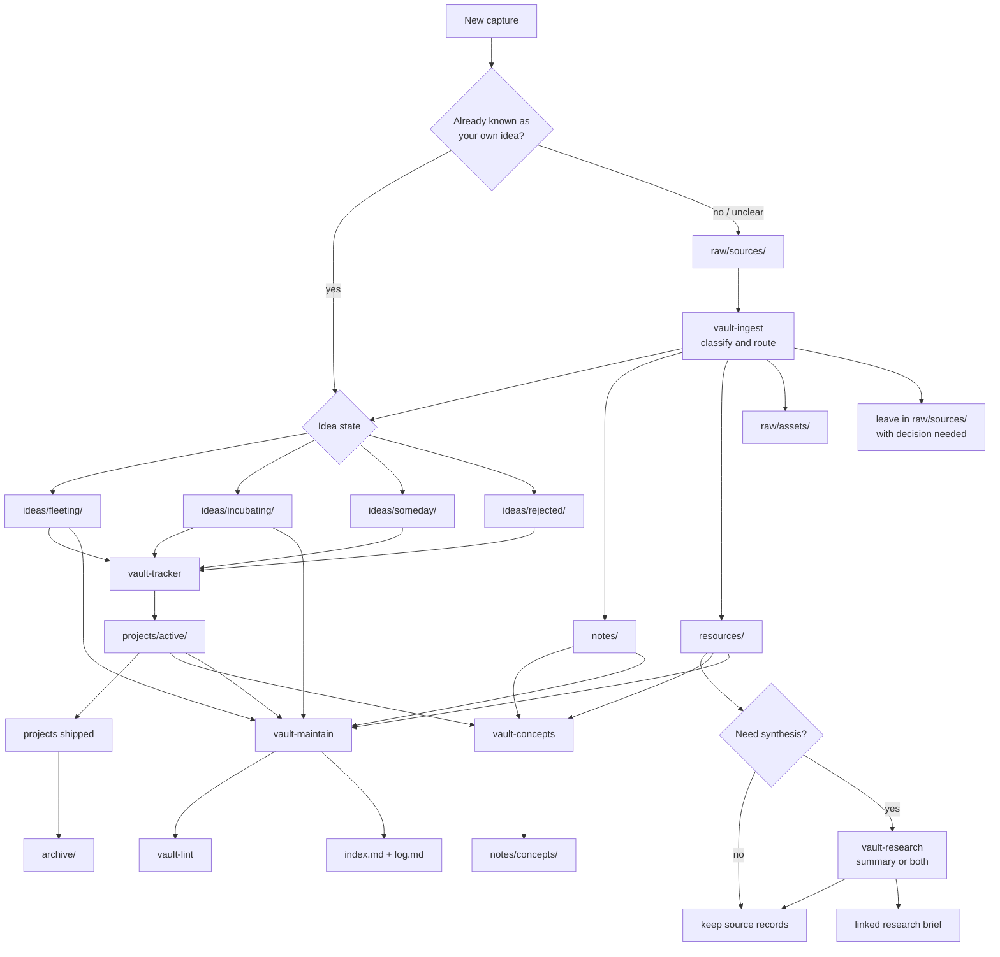

# Vault Plugin

Raw-first vault workflows for Obsidian.

## Current Skill Set

Core skills:

- `vault-ingest`: Categorize `raw/sources/` and move original source files to
  the correct vault locations.
- `vault-lint`: Audit active notes, ideas, projects, and resources for
  contradictions, stale content, weak links, and missing concepts.
- `vault-tracker`: Manage project lifecycle state and reconcile tracker entries
  with filesystem reality.
- `vault-maintain`: Run the bounded weekly maintenance loop across ingest,
  hygiene, tracking, and concepts.

Optional skills:

- `vault-concepts`: Promote recurring themes into canonical concept pages.
- `vault-research`: Collect external source records and optionally synthesize
  research summaries when requested.

## Flow

## Notes

- Top-level synced copies in `skills/` are regenerated via `npm run sync`.
- See [AGENTS.md](/Users/markphelps/workspace/claude-plugins/vault/AGENTS.md)
  for the canonical workflow and migration mapping.

## Subagents

- `vault_researcher` in `.codex/agents/vault-researcher.toml` for deep research
  delegation

## Structure

- `.codex-plugin/plugin.json`
- `skills/*/SKILL.md`
- `.codex/agents/*.toml`
- `AGENTS.md`

## Operational Conventions

- Skills are the runtime source of truth.
- Workflows should be non-destructive by default.
- `raw/sources/` is an unprocessed inbox for new captures.
- Known owned ideas should go directly to `ideas/fleeting/`,
  `ideas/incubating/`, `ideas/someday/`, or `ideas/rejected/` instead of
  lingering in `raw/sources/`.
- `raw/processed/` is an immutable archive for processed sources that did not
  have a better durable home.
- `archive/` is for archived curated material and is excluded from active
  navigation by default.
- Repeated patterns should graduate into canonical concept pages instead of
  remaining only in reports.
- Keep user note content intact unless explicit deletion is requested.
